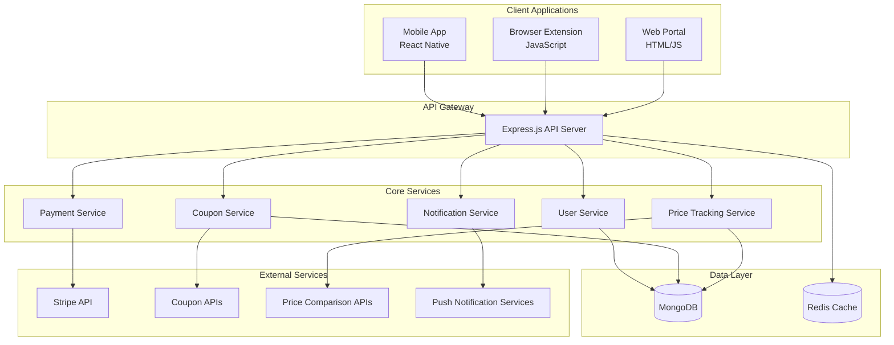

# Design Document

## Overview

ShopSavr is designed as a microservices-based cross-platform application with a shared backend API serving three client applications: a React Native mobile app, a Chrome/Firefox browser extension, and a web-based upgrade portal. The system uses a real-time synchronization architecture to ensure consistent user experience across all platforms.

## Architecture

### High-Level Architecture



### Technology Stack

**Backend:**
- Node.js with Express.js for API server
- MongoDB for primary data storage
- Redis for caching and session management
- Socket.io for real-time synchronization

**Mobile App:**
- React Native for cross-platform development
- React Navigation for routing
- AsyncStorage for local data persistence
- React Native Camera for barcode scanning

**Browser Extension:**
- Vanilla JavaScript with Chrome Extension APIs
- Content scripts for e-commerce site integration
- Background service worker for API communication

**Web Portal:**
- HTML5/CSS3/JavaScript
- Stripe Elements for payment processing

## Components and Interfaces

### API Endpoints

#### Authentication
- `POST /api/auth/register` - User registration
- `POST /api/auth/login` - User login
- `POST /api/auth/google` - Google OAuth login
- `POST /api/auth/refresh` - Token refresh

#### User Management
- `GET /api/user/profile` - Get user profile
- `PUT /api/user/profile` - Update user profile
- `GET /api/user/savings` - Get savings summary
- `POST /api/user/upgrade` - Process subscription upgrade

#### Coupon System
- `GET /api/coupons/search` - Search coupons for domain
- `POST /api/coupons/validate` - Validate coupon code
- `POST /api/coupons/apply` - Apply coupon and record savings

#### Wishlist Management
- `GET /api/wishlist` - Get user wishlist
- `POST /api/wishlist/add` - Add item to wishlist
- `DELETE /api/wishlist/:id` - Remove item from wishlist
- `GET /api/wishlist/price-updates` - Get price change notifications

#### Price Tracking
- `POST /api/price/scan` - Process barcode scan
- `GET /api/price/compare/:productId` - Get price comparison
- `POST /api/price/track` - Start tracking product price

#### Referral System
- `GET /api/referral/code` - Get user's referral code
- `POST /api/referral/claim` - Claim referral reward
- `GET /api/referral/stats` - Get referral statistics

### Data Models

#### User Model
```javascript
{
  _id: ObjectId,
  email: String,
  password: String, // hashed
  googleId: String,
  profile: {
    name: String,
    avatar: String
  },
  subscription: {
    tier: String, // 'free', 'pro', 'pro_max'
    status: String, // 'active', 'cancelled', 'expired'
    stripeCustomerId: String,
    subscriptionId: String,
    expiresAt: Date
  },
  savings: {
    totalSaved: Number,
    lifetimeSavings: Number,
    lastUpdated: Date
  },
  referral: {
    code: String,
    referredBy: ObjectId,
    referralCount: Number,
    earnedCredits: Number
  },
  settings: {
    notifications: Boolean,
    emailAlerts: Boolean
  },
  createdAt: Date,
  updatedAt: Date
}
```

#### Wishlist Item Model
```javascript
{
  _id: ObjectId,
  userId: ObjectId,
  product: {
    name: String,
    brand: String,
    barcode: String,
    image: String,
    category: String
  },
  tracking: {
    originalPrice: Number,
    currentPrice: Number,
    lowestPrice: Number,
    priceHistory: [{
      price: Number,
      date: Date,
      source: String
    }],
    lastChecked: Date
  },
  alerts: {
    priceDropThreshold: Number,
    enabled: Boolean
  },
  createdAt: Date
}
```

#### Coupon Model
```javascript
{
  _id: ObjectId,
  code: String,
  domain: String,
  description: String,
  discountType: String, // 'percentage', 'fixed', 'shipping'
  discountValue: Number,
  minimumOrder: Number,
  expiresAt: Date,
  isActive: Boolean,
  successRate: Number,
  lastTested: Date,
  source: String
}
```

## Error Handling

### API Error Responses
All API endpoints return consistent error responses:
```javascript
{
  error: {
    code: String, // 'VALIDATION_ERROR', 'AUTH_ERROR', etc.
    message: String,
    details: Object // Additional error context
  }
}
```

### Client-Side Error Handling
- Network errors: Retry with exponential backoff
- Authentication errors: Redirect to login
- Validation errors: Display inline form errors
- Server errors: Show user-friendly error messages

### Extension Error Handling
- Coupon application failures: Graceful fallback with manual code display
- Site compatibility issues: Silent failure with error logging
- API timeouts: Cache last known good coupons

## Testing Strategy

### Unit Testing
- Backend API endpoints with Jest and Supertest
- React Native components with React Native Testing Library
- Extension content scripts with Jest and jsdom

### Integration Testing
- API service integration tests
- Database operation tests
- External service mock testing (Stripe, coupon APIs)

### End-to-End Testing
- Mobile app user flows with Detox
- Extension functionality with Puppeteer
- Payment flow testing with Stripe test mode

### Performance Testing
- API load testing with Artillery
- Mobile app performance with Flipper
- Extension memory usage monitoring

### Security Testing
- Authentication flow security
- Payment processing security audit
- Data encryption validation
- SQL injection and XSS prevention

## Real-Time Synchronization

### WebSocket Implementation
- Socket.io for real-time updates
- User-specific rooms for targeted updates
- Event types: `wishlist_updated`, `price_drop`, `savings_updated`

### Offline Support
- Mobile app: AsyncStorage for offline data
- Extension: Chrome storage API for cached coupons
- Sync queue for offline actions

## Scalability Considerations

### Database Optimization
- MongoDB indexes on frequently queried fields
- Redis caching for user sessions and frequent data
- Database connection pooling

### API Performance
- Rate limiting to prevent abuse
- Response compression
- CDN for static assets

### Monitoring and Analytics
- Application performance monitoring
- User behavior analytics
- Error tracking and alerting